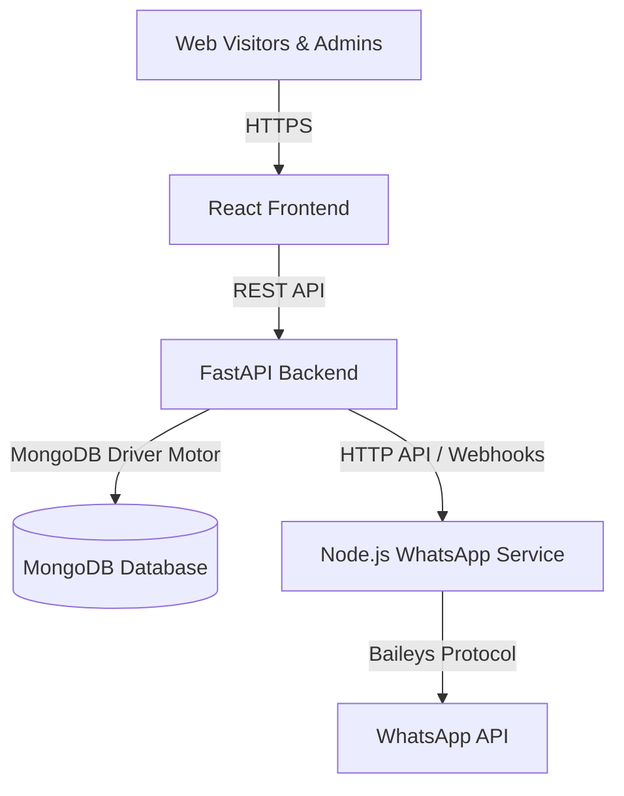

# S.D. Public School — Website & Admin Panel

A modern, full-featured school management platform and public website built for **S.D. Public School** (Patna). The system provides an interactive public portal, a comprehensive administrative control panel, a secure Transfer Certificate (TC) registry, an academic calendar/event manager, and an automated WhatsApp broadcast and notification system.

---

## 🏗️ System Architecture

The application is structured as a three-tier microservice architecture:



1. **Frontend**: A React 18 single-page application built with Create React App (CRA), styled using Tailwind CSS and `shadcn/ui` components, featuring route-level lazy loading for performance.
2. **Backend**: A high-performance asynchronous FastAPI (Python) service that manages business logic, JWT authentication, role-based authorization, image compression, database migrations, and integrations.
3. **WhatsApp Service**: A Node.js microservice leveraging the **Baileys** library to run a headless WhatsApp Web instance, handling QR code authentication, message queues, and media broadcasts.

---

## 🛠️ Tech Stack

| Service | Technology | Role |
| :--- | :--- | :--- |
| **Frontend** | React 18, React Router v6, Tailwind CSS, Lucide icons, Framer Motion | Public UI, Admissions, Careers, and Admin Dashboard |
| **Backend** | Python 3.10+, FastAPI, Motor (Async MongoDB), Pydantic v2 | API Gateway, authentication, document generation, mail/SMS senders |
| **Database** | MongoDB (v6.0+) | Persistent store for forms, logs, gallery, settings, and credentials |
| **WhatsApp Service** | Node.js (v20+), Baileys, Express | QR code pairing, headless WhatsApp session persistence, broadcast queues |

---

## 📋 Prerequisites

Ensure you have the following installed on your development machine:
- **Node.js** v20.x or higher
- **Python** 3.10 or higher
- **MongoDB** v6.0+ (Local community edition or MongoDB Atlas URI)
- **npm** v9+ or **yarn**

---

## 🚀 Quick Start (Local Development)

### 1. Database Setup
Ensure your MongoDB instance is running locally:
```bash
# macOS Community MongoDB
brew services start mongodb-community@6.0
```

---

### 2. Backend Service
1. Navigate to the backend directory:
   ```bash
   cd backend
   ```
2. Copy the environment variables example and configure the values:
   ```bash
   cp .env.example .env
   ```
3. Create a python virtual environment and activate it:
   ```bash
   python -m venv venv
   source venv/bin/activate
   ```
4. Install dependencies:
   ```bash
   pip install -r requirements.txt
   ```
5. Run the development server:
   ```bash
   uvicorn server:app --reload --port 8000
   ```
   *The interactive Swagger documentation will be available at [http://localhost:8000/docs](http://localhost:8000/docs).*

---

### 3. WhatsApp Microservice (Optional)
1. Navigate to the WhatsApp service directory:
   ```bash
   cd whatsapp-service
   ```
2. Copy the environment variables example and configure:
   ```bash
   cp .env.example .env
   ```
3. Install dependencies:
   ```bash
   npm install
   ```
4. Run the service:
   ```bash
   npm start
   ```
   *The service will start on [http://localhost:3001](http://localhost:3001).*

---

### 4. Frontend Application
1. Navigate to the frontend directory:
   ```bash
   cd frontend
   ```
2. Copy the environment variables example and set the backend URL:
   ```bash
   cp .env.example .env
   ```
   *Set `REACT_APP_BACKEND_URL=http://localhost:8000` to point to your local backend.*
3. Install dependencies:
   ```bash
   npm install --legacy-peer-deps
   ```
4. Start the React development server:
   ```bash
   npm start
   ```
   *Open [http://localhost:3000](http://localhost:3000) to view the website.*

---

## ⚙️ Key Environment Variables

### Backend (`backend/.env`)
| Key | Description | Default / Example |
| :--- | :--- | :--- |
| `MONGO_URL` | MongoDB Connection URI | `mongodb://localhost:27017` |
| `DB_NAME` | Database Name | `sdps_portal` |
| `JWT_SECRET` | Secret key for signing authorization tokens | *Random 32+ character string* |
| `WA_SERVICE_URL` | URL of the WhatsApp microservice | `http://localhost:3001` |
| `WA_API_SECRET` | Authentication token matching WhatsApp Service | *Shared secure key* |

### Frontend (`frontend/.env`)
| Key | Description | Default / Example |
| :--- | :--- | :--- |
| `REACT_APP_BACKEND_URL` | Base URL of the API Backend | `http://localhost:8000` |

### WhatsApp Service (`whatsapp-service/.env`)
| Key | Description | Default / Example |
| :--- | :--- | :--- |
| `PORT` | Listening Port | `3001` |
| `WA_API_SECRET` | Authentication token matching Backend | *Shared secure key* |
| `WA_AUTH_DIR` | Directory to save paired device sessions | `./auth_state` |

---

## 📂 Project Structure

```
sdps-website-main/
├── backend/                  # FastAPI codebase
│   ├── routes_admin.py       # Protected admin route handlers
│   ├── routes_public.py      # Public page APIs & admissions
│   ├── server.py             # App entry point, CORS, and Middlewares
│   └── requirements.txt      # Python dependencies
├── frontend/                 # React frontend SPA
│   ├── public/               # Static web assets & template HTML
│   └── src/
│       ├── components/       # Reusable layout and admin UI components
│       ├── lib/              # API clients, authentication, and pinger utility
│       ├── pages/            # Page-level views (split by public/admin)
│       ├── App.js            # Router mapping & global layouts
│       └── index.css         # Modern styling rules and utility tokens
└── whatsapp-service/         # Node.js + Baileys microservice
    ├── index.js              # Server entry point
    └── package.json          # Node dependencies
```

---

## ✨ Features

- **Dynamic Content Manager**: Admins can update announcements, news feeds, picture galleries, and the academic calendar instantly.
- **Smart Admission & Career Pipelines**: Form builders, file attachments, and applicant dashboards for hassle-free registrations.
- **Headerless WhatsApp Integrations**: Scan a QR code to link any official phone number and blast out student fee reminders or automated admission alerts.
- **Automated Performance Adjustments**: Below-the-fold image lazy loading, prefers-reduced-motion compatibility, and dynamic code splitting to optimize Largest Contentful Paint (LCP).

---

## 🔒 Security & Deployment

- Refer to [DEPLOYMENT.md](./DEPLOYMENT.md) for Render deployment configuration, MongoDB hosting, and scaling guidelines.
- Refer to `SECURITY_REPORT.md` (if present) for details on JWT authorization flows, cookie protection, and masked API credentials.

---

## 📄 License

This project is licensed under the terms of the license contract with S.D. Public School.
